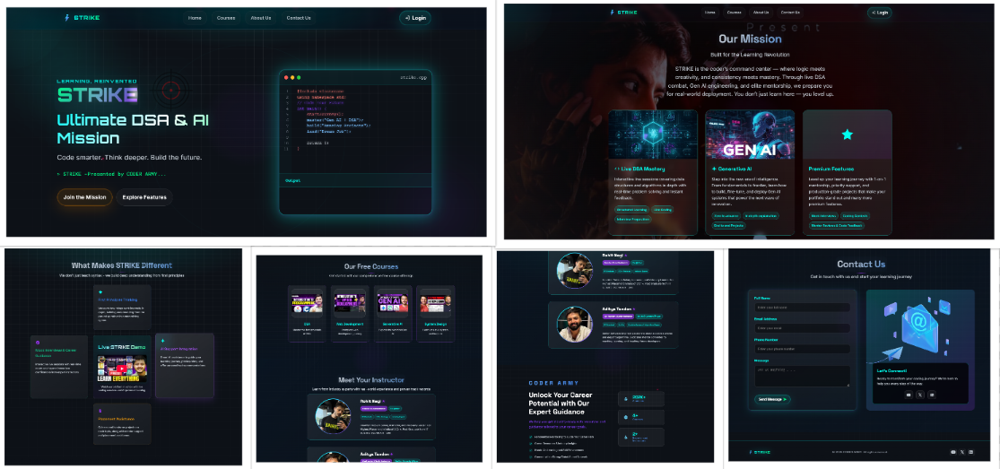

# STRIKE - Premium Course Platform

**Live Demo:** [View Project](YOUR_DEPLOYED_LINK_HERE)

## About This Project

This is a submission for the **Coder Army CSS Hackathon 2025**, showcasing a creative website design for STRIKE - an upcoming premium course platform. Built entirely with HTML and CSS (no JavaScript), this project demonstrates modern web design principles and responsive development techniques.

STRIKE is Coder Army's upcoming premium paid course platform launching in Q1 2025, featuring structured DSA preparation, Generative AI projects, mentor support, and placement assistance.

## Screenshots

### Project Demo



### Mobile View  


## Key Features

- **Interactive Code Editor**: Live C++ code display with animated terminal output
- **Pure CSS Animations**: Custom typing effects, floating particles, and neon glow effects
- **Mobile-First Responsive Design**: Fully optimized for mobile, tablet, and desktop
- **Modern UI/UX**: Futuristic design with glassmorphism effects and gradient animations
- **HTML & CSS Only**: Zero JavaScript - fully hackathon compliant
- **Course Integration**: Direct integration with Coder Army's free course playlists
- **Interactive Elements**: Card flip animations, hover effects, and smooth transitions
- **Professional Typography**: Multi-font system with fluid responsive scaling

## Technology Stack

- **HTML5**: Semantic markup with ARIA accessibility
- **CSS3**: Advanced Grid, Flexbox, custom properties, and keyframe animations
- **Google Fonts**: Orbitron, Space Grotesk, Roboto Mono, Inter
- **No Frameworks**: Pure vanilla CSS with zero dependencies

## Hackathon Compliance

This project meets all Coder Army CSS Hackathon 2025 requirements:
- HTML & CSS only (no JavaScript)
- Fully responsive design (mobile, tablet, desktop)
- Creative CSS animations and effects
- Public GitHub repository
- Professional README with setup instructions
- Deployed on modern hosting platform

## Quick Start

1. **Clone the repository**
   ```bash
   git clone https://github.com/YOUR_USERNAME/STRIKE-Website.git
   cd STRIKE-Website
   ```

2. **Run locally** (choose one method):

   **Direct browser opening:**
   ```bash
   # Simply open index.html in your browser
   open index.html  # macOS
   start index.html # Windows
   ```

   **Local development server:**
   ```bash
   # Python
   python -m http.server 8000
   
   # Node.js
   npx serve .
   
   # PHP
   php -S localhost:8000
   ```

   **VS Code Live Server:**
   - Install Live Server extension
   - Right-click index.html → "Open with Live Server"

3. **View in browser**: Navigate to `http://localhost:8000` (if using server)

## Project Structure

```
STRIKE-Website/
├── index.html              # Main HTML file
├── style.css              # All styles and animations
├── assets/                # Images and media files
│   ├── logo.png
│   ├── dsa.jpg
│   ├── ai.jpg
│   ├── rohit.jpg
│   ├── aditya.jpg
│   └── ...
├── screenshots/           # Project screenshots
│   ├── desktop-view.png
│   ├── mobile-view.png
│   └── features-section.png
└── README.md             # Project documentation
```

## Design Highlights

**Desktop Experience:**
- Side-by-side hero layout with interactive code editor
- Multi-column grids with smooth hover animations
- Advanced glassmorphism effects and neon lighting
- Professional typography with gradient text effects

**Mobile Experience:**
- Mobile-first responsive architecture
- Touch-optimized interactions and navigation
- Guaranteed code editor and terminal visibility
- Properly scaled typography and spacing

**Interactive Elements:**
- Pure CSS typing animation with multiple text sequences
- Floating particle system with CSS keyframes
- Card flip animations and hover transformations
- Smooth gradient transitions and glow effects

## Browser Support

- **Chrome 90+** - Full support
- **Firefox 88+** - Full support  
- **Safari 14+** - Full support
- **Edge 90+** - Full support

## Responsive Design

- **Mobile (≤ 767px)**: Single column layout, touch-optimized interface
- **Tablet (768px - 1023px)**: Hybrid layout with optimized spacing
- **Desktop (≥ 1024px)**: Full multi-column experience with advanced effects

## Deployment Options

**GitHub Pages:**
1. Push to GitHub repository
2. Go to Settings → Pages
3. Deploy from main branch
4. Access at `https://username.github.io/repository-name`

**Netlify:**
1. Connect GitHub repository
2. No build configuration needed
3. Automatic deployment on push

**Vercel:**
1. Import GitHub repository  
2. Deploy with zero configuration
3. Instant global CDN

## Social Media Sharing

As part of the hackathon requirements, share your project:

**Required hashtags:** `#STRIKEClone #HTMLCSSOnly #WebClone #CSSChallenge`

**Twitter/LinkedIn post example:**
"Just completed my submission for the Coder Army CSS Hackathon 2025! Built a fully responsive STRIKE platform clone using only HTML & CSS. Check out the live demo: [your-link] #STRIKEClone #HTMLCSSOnly #WebClone #CSSChallenge"

## Author

**Your Name** - [GitHub](https://github.com/your-username) | [LinkedIn](https://linkedin.com/in/your-profile)

## Acknowledgments

- **Coder Army** for organizing the CSS Hackathon 2025
- **STRIKE Platform** concept and branding inspiration
- **CSS-only animation techniques** from the web development community

---

**Built for Coder Army CSS Hackathon 2025**